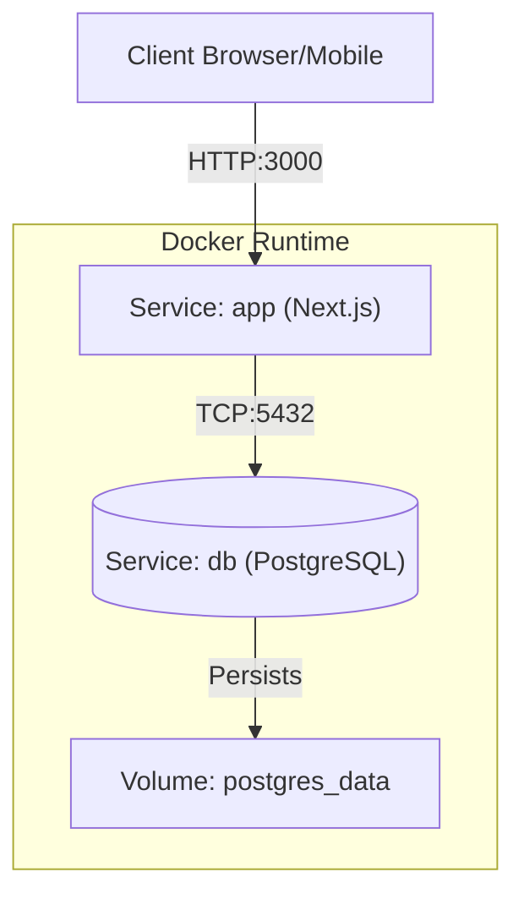

# SmartWaste Cloud Native Application

## Descrizione del Progetto
SmartWaste è un'applicazione web cloud-native progettata per localizzare punti di raccolta differenziata e fornire informazioni sullo smaltimento dei rifiuti.
Questo progetto è un'evoluzione del Modulo 1, reingegnerizzata per soddisfare i requisiti **Cloud Native**:
- **Microservizi/Containerizzazione**: L'intera applicazione è contenerizzata con Docker.
- **Database Relazionale**: Migrazione da SQLite a **PostgreSQL** per la persistenza dei dati in produzione.
- **Configuration Management**: Gestione della configurazione tramite variabili d'ambiente.
- **Stateless Application**: Il core dell'applicazione è stateless e delega lo stato al database.

## Architettura
L'architettura del sistema si basa su container Docker orchestrati tramite Docker Compose.



### Componenti
1.  **Frontend/Backend (Container `app`)**:
    -   Framework: **Next.js 15**.
    -   Funzioni: Rendering UI, API REST, Autenticazione (NextAuth.js).
    -   ORM: **Prisma** per l'interazione con il database.
    -   Entrypoint: Script custom per l'esecuzione automatica delle migrazioni all'avvio.

2.  **Database (Container `db`)**:
    -   Immagine: `postgres:15-alpine`.
    -   Persistenza: Volume Docker `postgres_data` per garantire che i dati sopravvivano al riavvio dei container.

## Requisiti
-   **Docker Desktop** installato e in esecuzione.
-   **Git**.

## Installazione e Avvio (Build from Scratch)

### 1. Clona il Repository
```bash
git clone <repository-url>
cd Progetto-Cloud-SmartWaste
```

### 2. Configura le Variabili d'Ambiente
Copia il file di esempio `.env.example` in `.env`.
Il file `.env` è configurato di default per funzionare con Docker Compose locale.

```bash
# Windows (PowerShell)
copy .env.example .env

# Mac/Linux
cp .env.example .env
```

Assicurati che `DATABASE_URL` sia:
```
DATABASE_URL="postgresql://user:password@db:5432/smartwaste"
```
Se modifichi user/password nel `docker-compose.yml`, ricorda di aggiornarle anche qui.

### 3. Avvia con Docker Compose
Esegui il comando per costruire le immagini e avviare i container:

```bash
docker compose up --build
```

Al primo avvio, l'applicazione:
1.  Scaricherà le immagini necessarie (Node.js, Postgres).
2.  Costruirà l'immagine dell'applicazione Next.js (`smartwaste-app`).
3.  Attenderà che il database sia pronto.
4.  **Eseguirà automaticamente le migrazioni** del database (creazione tabelle).
5.  Avvierà il server web sulla porta **3000**.

### 4. Accedi all'Applicazione
Apri il browser e naviga su:
[http://localhost:3000](http://localhost:3000)

## Credenziali di Prova
Al primo avvio, il database viene popolato automaticamente con utenti di test:

| Ruolo | Email | Password |
|-------|-------|----------|
| 👤 Utente | `mario.rossi@example.com` | `Password123!` |
| 👤 Utente | `giulia.verdi@example.com` | `Password123!` |
| 👨‍💼 Operatore | `operatore@smartwaste.it` | `Password123!` |

Puoi anche registrare un nuovo utente dalla pagina di registrazione.

## Scelte Progettuali e Cloud Native

### Perché Next.js?
Next.js permette di avere Frontend e Backend nello stesso artefatto, semplificando il deployment come singolo servizio stateless, pur mantenendo la flessibilità di separare le API se necessario.

### Perché PostgreSQL?
SQLite (usato in dev) non supporta la concorrenza e la persistenza corretta in ambienti containerizzati effimeri. PostgreSQL è lo standard de-facto per applicazioni cloud-native relazionali.

### Gestione dei Segreti
Nessun segreto è hardcodato. Tutti i valori sensibili (`Use`, `Password` DB, `AUTH_SECRET`) sono iniettati a runtime tramite `docker-compose.yml` o file `.env` non committati.

### Persistenza
I dati del database sono salvati in un **Docker Volume** (`postgres_data`). Questo garantisce che `docker compose down` e successivi `up` non causino la perdita dei dati degli utenti.

## Comandi Utili

**Fermare l'applicazione**
```bash
docker compose down
```

**Riavviare e forzare la rebuild**
```bash
docker compose up --build --force-recreate
```

**Visualizzare i log**
```bash
docker compose logs -f
```

## Struttura Repository
- `/src`: Codice sorgente Next.js
- `/prisma`: Schema del database e seed
- `/docs`: Diagrammi architetturali
- `/.github/workflows`: Pipeline CI/CD
- `Dockerfile`: Definizione per la build dell'immagine app
- `docker-compose.yml`: Orchestrazione dei container
- `docker-entrypoint.sh`: Script di avvio per schema push e seed

## CI/CD
Il progetto include una pipeline GitHub Actions (`.github/workflows/ci.yml`) che:
1. Esegue il linting del codice
2. Costruisce l'applicazione Next.js
3. Costruisce l'immagine Docker

La pipeline viene eseguita automaticamente ad ogni push o pull request sul branch `main`.

